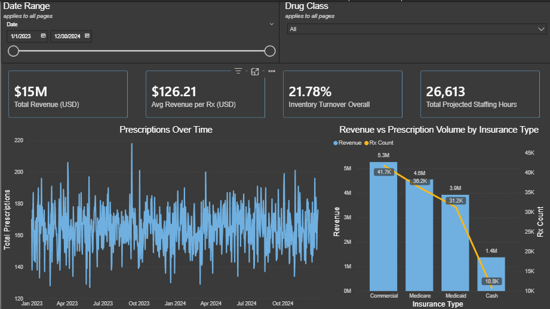
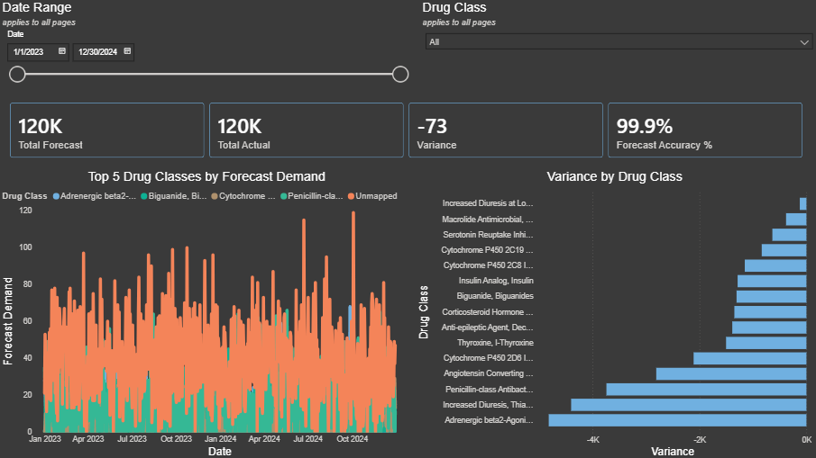
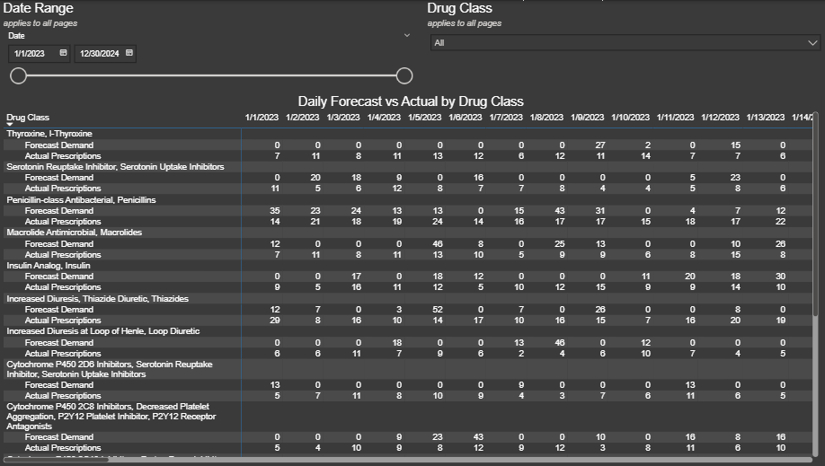
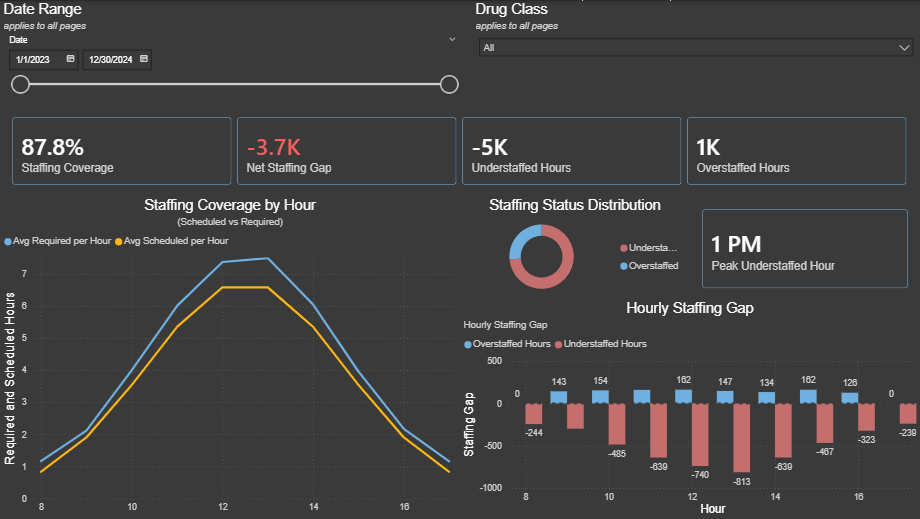
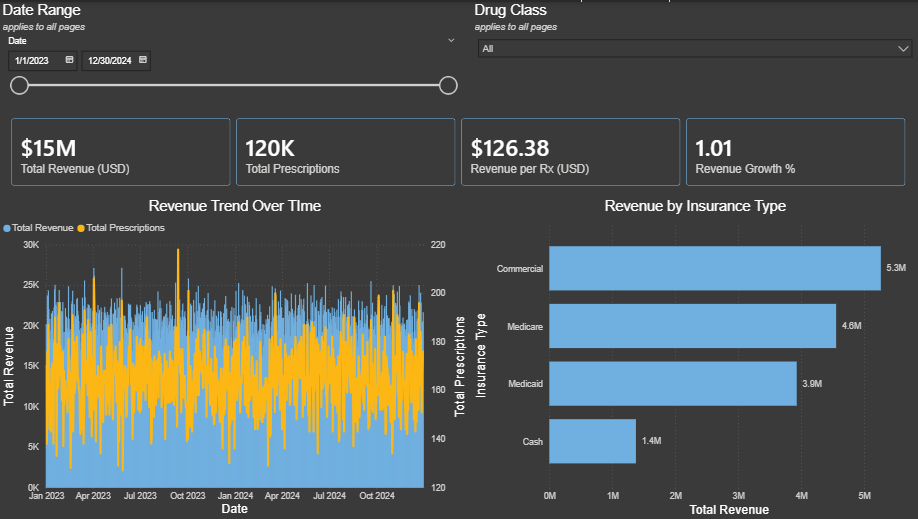
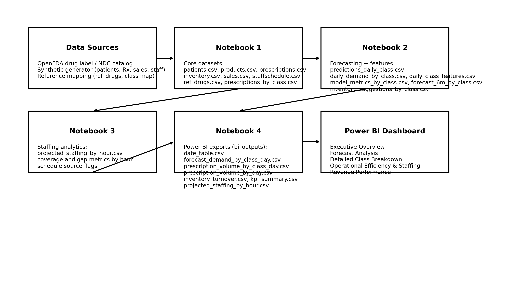

# Pharmacy Operations Optimization

End-to-end analytics pipeline for forecasting prescription demand, optimizing staffing coverage, and analyzing pharmacy revenue performance within a simulated long-term care pharmacy environment.

This project integrates Python, SQL, R, and Power BI to deliver a unified decision support framework for operational and financial planning.

---

## Executive Summary

This project develops a full analytics workflow to model pharmacy operations across demand, staffing, inventory, and revenue domains. Synthetic data generation enables controlled experimentation while preserving realistic operational patterns and protecting patient information.

Key outcomes include:

- Improved visibility into peak workload periods  
- Identification of staffing imbalances  
- Forecast-driven inventory planning  
- Revenue distribution analysis across insurance types and drug classes  

The resulting dashboard provides pharmacy leadership with actionable insights for workforce planning and financial optimization.

---

## Dashboard Overview

The Power BI dashboard imports only `/bi_outputs` and uses `date_table` for relationships. It is organized into five analytical views. 

---

### Executive Overview

Provides high-level KPIs, including total prescriptions, forecast accuracy, inventory turnover, and revenue metrics.



---

### Forecast Analysis

Visualizes demand trends and forecast variance across drug classes to support proactive planning.



---

### Detailed Class Breakdown

Enables granular inspection of forecast versus actual prescription activity at the drug class level.



---

### Operational Efficiency and Staffing

Evaluates hourly staffing coverage and identifies periods of operational risk and imbalance.



---

### Revenue Performance

Analyzes revenue distribution by insurance type and examines the relationship between prescription volume and financial performance.



---

## Project Architecture

The pipeline follows a layered analytics architecture from data generation through BI visualization.



### Flow

1. Synthetic and reference data generation  
2. Feature engineering and demand forecasting  
3. Operational analytics and staffing modeling  
4. Revenue aggregation and KPI computation  
5. Power BI dashboard visualization  

---

## Repository Structure

```text
.
├── README.md
├── report/
│   └── Report.pdf
├── docs/
│   ├── architecture_diagram.png
│   └── dashboard_screenshots/
├── notebooks/
│   ├── Notebook1.ipynb
│   ├── Notebook2.ipynb
│   ├── Notebook3.ipynb
│   └── Notebook4.ipynb
├── data/
│   ├── raw/              
│   └── generated/        
├── bi_outputs/           
├── src/                  
├── requirements.txt
└── .gitignore
```
---

## Key Outputs

### Core Data (Notebook 1)

- `patients.csv`  
- `products.csv`  
- `prescriptions.csv`  
- `inventory.csv`  
- `sales.csv`  
- `staffschedule.csv`  
- `ref_drugs.csv`  
- `prescriptions_by_class.csv`  

### Forecasting and Modeling (Notebook 2)

- `predictions_daily_class.csv`  
- `forecast_demand_by_class_day.csv`  
- `daily_demand_by_class.csv`  
- `inventory_suggestions_by_class.csv`  
- `daily_class_features.csv`  
- `model_metrics_by_class.csv`  
- `forecast_6m_by_class.csv`  

### Operational Analytics (Notebook 3)

- `projected_staffing_by_hour.csv`  
- `staff_coverage_*.csv`  

### BI Outputs (Notebook 4)

- `date_table.csv`  
- `kpi_summary.csv`  
- `inventory_turnover.csv`  
- `prescription_volume_by_day.csv`  
- `prescription_volume_by_class_day.csv`  
- `forecast_demand_by_class_day.csv`  

---

## Data Sources

- Drug reference data derived from OpenFDA NDC Directory  
- All patient-level and operational data are synthetically generated for privacy protection  

---

## How to Run Locally

### 1. Clone the repository

```bash
git clone https://github.com/YOUR_USERNAME/pharmacy-operations-optimization.git
cd pharmacy-operations-optimization
```

### 2. Create environment

```bash
python -m venv .venv
source .venv/bin/activate
pip install -r requirements.txt
```

### 3. Execute notebooks in order

Run the notebooks sequentially:

```
Notebook1.ipynb
Notebook2.ipynb
Notebook3.ipynb
Notebook4.ipynb
```

This regenerates all datasets required for the Power BI dashboard.

### 4. Open Power BI

Load data from:

```
bi_outputs/
```

Then refresh the model.

---

## Skills Demonstrated

- Demand forecasting and time series analysis  
- Operational staffing analytics  
- Healthcare revenue analysis  
- Data pipeline engineering  
- SQL data modeling  
- Power BI dashboard design  
- Python and R analytical workflows  

---

## Author

**Selena Jesse Davis**  
BS Mathematics, Indiana University East  
